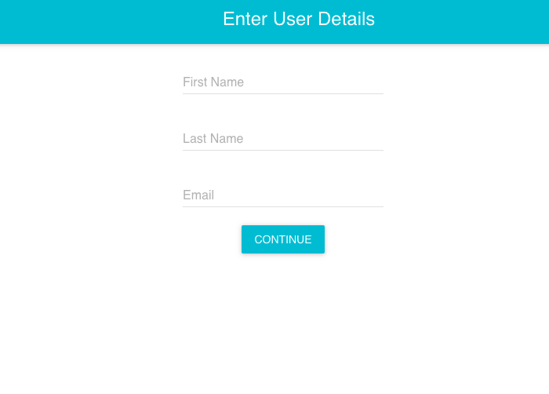
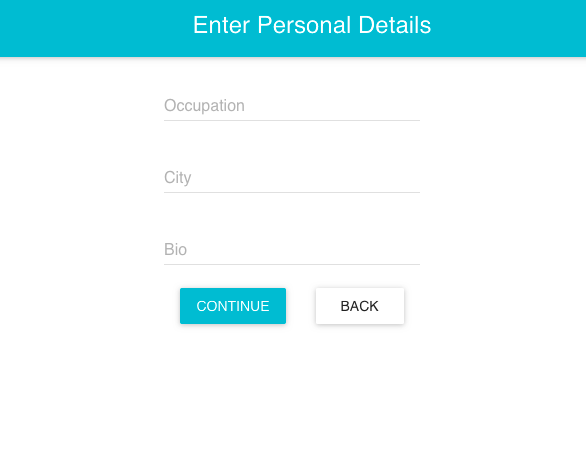
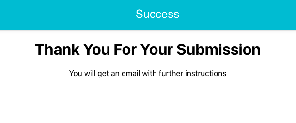

# React Step Form

> Form with multiple steps and confirmation. Frontend only, no API. Uses Material UI!

### User Details Form



### Personal Details Form



### Successful Form Submission



## Quick Start

```bash
# Install dependencies
npm install

# Serve on localhost:3000
npm start

# Build for production
npm run build
```

## App Info

### Author

Nihal Kaul

### Version

1.0.0

### License

This project is licensed under the MIT License
